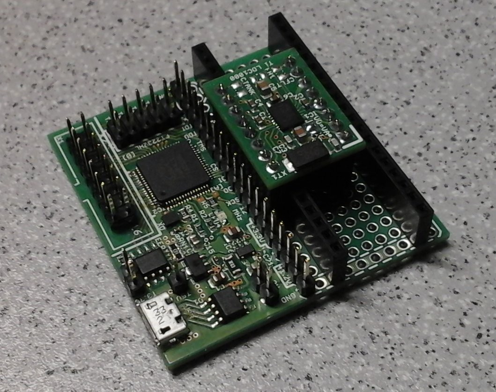
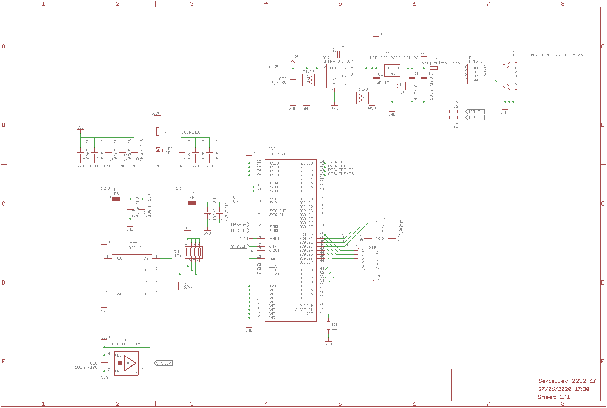
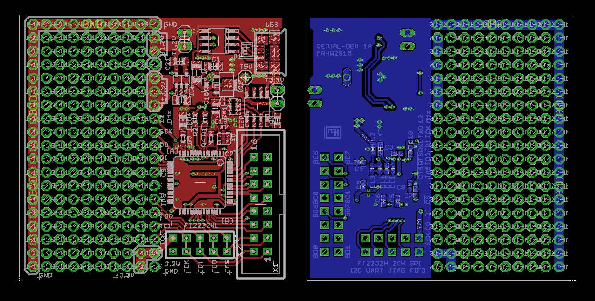

## SerialDev-2232 ##
The SerialDev-2232 board is a 50 x 50 mm² prototyping PCB with a FTDI FT2232HQ USB interface IC, 12 MHz oscillator and 3.3V, 1.2V LDOs. 

It breaks out the two Multi-Protocol Synchronous Serial Engine (MPSSE) ports, one particularly labeled as a JTAG / SPI / UART port, the other one as a full 16 I/O interface including the 8 bit parallel 245 type FIFO / bit banging interface.

Half of the PCB is dedicated to 5V, 3.3V, 1.2V supplies, 12 MHz clock source and a fully implemented FT2232H with EEPROM, all of which also feed into a linear header (cut the PCB in half for breadboard depolyment). The rest is just 0.1" perf board. 

### assembled PCB ###

### schematic ###

### layout ###

### further information ###

For more please also check out https://hackaday.io/project/9902-serial-dev-2232.